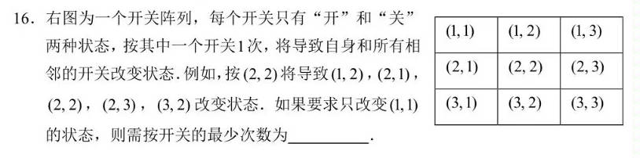

# SwitchArray

A math question appeared in a recent major examination in China.

Simple translation: 

There is a switch array, each with a true or false status.

Pressing a switch will change the status of the adjacent ones, including itself.

For example, pressing (2, 2) will change (1, 2), (2, 1), (2, 2), (2, 3), and (3, 2).

To change only (1, 1), determine the minimum number of times.
